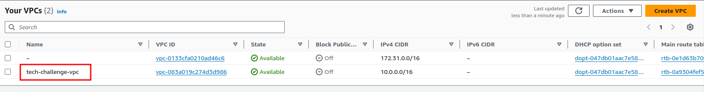

# Tech Challenge - VPC

 

## 💻 Descrição

Este repositório é responsável por criar a VPC.

## 🛠 Tecnologias Utilizadas

![AWS](https://img.shields.io/badge/AWS%20VPC-6C3EC9.svg?style=for-the-badge&logo=data:image/svg%2bxml;base64,PHN2ZyB4bWxucz0iaHR0cDovL3d3dy53My5vcmcvMjAwMC9zdmciIHhtbG5zOnhsaW5rPSJodHRwOi8vd3d3LnczLm9yZy8xOTk5L3hsaW5rIiB3aWR0aD0iMzQiIGhlaWdodD0iMzQiIHZpZXdCb3g9IjAgMCAyNCAyNCIgdmVyc2lvbj0iMS4xIj48c2NyaXB0IHhtbG5zPSIiIGlkPSJlcHBpb2NlbWhtbmxiaGpwbGNna29mY2lpZWdvbWNvbiI+PC9zY3JpcHQ+PHNjcmlwdCB4bWxucz0iIj48L3NjcmlwdD48c2NyaXB0IHhtbG5zPSIiPjwvc2NyaXB0PgogICAgPCEtLSBHZW5lcmF0b3I6IFNrZXRjaCA2NCAoOTM1MzcpIC0gaHR0cHM6Ly9za2V0Y2guY29tIC0tPgogICAgPHRpdGxlPkljb24tQXJjaGl0ZWN0dXJlLzE2L0FyY2hfQW1hem9uLVZpcnR1YWwtUHJpdmF0ZS1DbG91ZF8xNjwvdGl0bGU+CiAgICA8ZGVzYz5DcmVhdGVkIHdpdGggU2tldGNoLjwvZGVzYz4KICAgIDxkZWZzPgogICAgICAgIDxsaW5lYXJHcmFkaWVudCB4MT0iMCUiIHkxPSIxMDAlIiB4Mj0iMTAwJSIgeTI9IjAlIiBpZD0ibGluZWFyR3JhZGllbnQtMSI+CiAgICAgICAgICAgIDxzdG9wIHN0b3AtY29sb3I9IiM0RDI3QTgiIG9mZnNldD0iMCUiPjwvc3RvcD4KICAgICAgICAgICAgPHN0b3Agc3RvcC1jb2xvcj0iI0ExNjZGRiIgb2Zmc2V0PSIxMDAlIj48L3N0b3A+CiAgICAgICAgPC9saW5lYXJHcmFkaWVudD4KICAgIDwvZGVmcz4KICAgIDxnIGlkPSJJY29uLUFyY2hpdGVjdHVyZS8xNi9BcmNoX0FtYXpvbi1WaXJ0dWFsLVByaXZhdGUtQ2xvdWRfMTYiIHN0cm9rZT0ibm9uZSIgc3Ryb2tlLXdpZHRoPSIxIiBmaWxsPSJub25lIiBmaWxsLXJ1bGU9ImV2ZW5vZGQiPgogICAgICAgIDxnIGlkPSJJY29uLUFyY2hpdGVjdHVyZS1CRy8xNi9OZXR3b3JraW5nLUNvbnRlbnQtRGVsaXZlcnkiIGZpbGw9InVybCgjbGluZWFyR3JhZGllbnQtMSkiPgogICAgICAgICAgICA8cmVjdCBpZD0iUmVjdGFuZ2xlIiB4PSIwIiB5PSIwIiB3aWR0aD0iMjQiIGhlaWdodD0iMjQiPjwvcmVjdD4KICAgICAgICA8L2c+CiAgICAgICAgPHBhdGggZD0iTTE2Ljk5NywxMS44MjEwNzQzIEwxNS4wNzQsMTAuODAzMDc0MyBMMTUuMDc0LDE4LjQ2MTA3NDMgQzE2Ljk1OCwxOC4wODMwNzQzIDE2Ljk5NiwxNS42MzIwNzQzIDE2Ljk5NywxNS41MTkwNzQzIEwxNi45OTcsMTEuODIxMDc0MyBaIE0xMi44NTEsMTcuODc1MDc0MyBDMTMuMTc4LDE4LjIwMjA3NDMgMTMuNTgxLDE4LjQwMDA3NDMgMTQuMDc0LDE4LjQ3NzA3NDMgTDE0LjA3NCwxMC43ODIwNzQzIEwxMS45ODEsMTEuODI5MDc0MyBMMTEuOTgxLDE1LjUyMDA3NDMgQzExLjk4MSwxNS41MzcwNzQzIDExLjk4OCwxNy4wMTAwNzQzIDEyLjg1MSwxNy44NzUwNzQzIEwxMi44NTEsMTcuODc1MDc0MyBaIE0xNy45OTcsMTEuNTIwMDc0MyBMMTcuOTk3LDE1LjUyMDA3NDMgQzE3Ljk5NywxNi45MDIwNzQzIDE3LjI4LDE5LjUxNDA3NDMgMTQuNTY3LDE5LjUxNDA3NDMgQzEzLjU3MywxOS41MTQwNzQzIDEyLjc1NiwxOS4xOTkwNzQzIDEyLjEzOCwxOC41NzYwNzQzIEMxMC45ODA5NDYsMTcuNDExMDc0MyAxMC45OCwxNS41OTMwNzQzIDEwLjk4MDk0NiwxNS41MTYwNzQzIEwxMC45ODA5NDYsMTEuNTIwMDc0MyBDMTAuOTgwOTQ2LDExLjMzMDA3NDMgMTEuMDg5LDExLjE1NzA3NDMgMTEuMjU4LDExLjA3MjA3NDMgTDE0LjM1MSw5LjUyNjA3NDMyIEMxNC40OTUsOS40NTMwNzQzMiAxNC42NjcsOS40NTYwNzQzMiAxNC44MDgsOS41MzEwNzQzMiBMMTcuNzMsMTEuMDc4MDc0MyBDMTcuODk0LDExLjE2NDA3NDMgMTcuOTk3LDExLjMzNTA3NDMgMTcuOTk3LDExLjUyMDA3NDMgTDE3Ljk5NywxMS41MjAwNzQzIFogTTE5LjY5LDkuNzM1MDc0MzIgTDE4Ljc1MywxMC4wODEwNzQzIEMxOC41NDcsOS41MjQwNzQzMiAxOC4xOTksOS4yOTYwNzQzMiAxNy41NTUsOS4yOTYwNzQzMiBDMTcuMjksOS4yOTYwNzQzMiAxNy4wNzEsOS4wOTAwNzQzMiAxNy4wNTYsOC44MjYwNzQzMiBDMTYuOTg2LDcuNjYzMDc0MzIgMTYuMzg5LDcuMTA2MDc0MzIgMTUuODYyLDcuMDc5MDc0MzIgQzE1LjE4OSw3LjA0ODA3NDMyIDE0Ljk2OCw3LjMzNjA3NDMyIDE0Ljg5NCw3LjQzMTA3NDMyIEMxNC43ODMsNy41NzcwNzQzMiAxNC42LDcuNjQ5MDc0MzIgMTQuNDIyLDcuNjI0MDc0MzIgQzE0LjI0MSw3LjU5NjA3NDMyIDE0LjA4OSw3LjQ3MzA3NDMyIDE0LjAyNiw3LjMwMTA3NDMyIEMxMy44MTEsNi43MTMwNzQzMiAxMy41MDksNi4yNDIwNzQzMiAxMy4wNzYsNS44MjAwNzQzMiBDMTIuMTQ0LDQuOTE4MDc0MzIgMTAuNDA3LDQuNzMxMDc0MzIgOC44NTEsNS4zNjkwNzQzMiBDNy43ODksNS44MDQwNzQzMiA3LjEwMiw2LjkyNzA3NDMyIDcuMTAyLDguMjMwMDc0MzIgQzcuMTAyLDguMzc0MDc0MzIgNy4xMjEsOC41OTgwNzQzMiA3LjEzOCw4LjczNzA3NDMyIEM3LjE2OCw4Ljk4NzA3NDMyIDcuMDA3LDkuMjIwMDc0MzIgNi43NjIsOS4yODEwNzQzMiBDNS41NzYsOS41NzUwNzQzMiA1LDEwLjI1NTA3NDMgNSwxMS4zNTcwNzQzIEM1LDExLjQwNzA3NDMgNC45OTksMTEuNDU4MDc0MyA1LjAwNCwxMS41MDgwNzQzIEM1LjA2MSwxMi41MTcwNzQzIDUuNjEzLDEzLjU3NzA3NDMgNi45OTUsMTMuNTc3MDc0MyBMOC45OTcsMTMuNTc3MDc0MyBMOC45OTcsMTQuNTc3MDc0MyBMNi45OTUsMTQuNTc3MDc0MyBDNS4zMDksMTQuNTc3MDc0MyA0LjEwNywxMy4zNzMwNzQzIDQuMDA3LDExLjU4MTA3NDMgQzQuMDAxLDExLjUxNzA3NDMgNCwxMS40MzcwNzQzIDQsMTEuMzU3MDc0MyBDNCw5LjkzMzA3NDMyIDQuNzQ1LDguOTA4MDc0MzIgNi4xMDksOC40MzMwNzQzMiBDNi4xMDUsOC4zNjAwNzQzMiA2LjEwMiw4LjI4OTA3NDMyIDYuMTAyLDguMjMwMDc0MzIgQzYuMTAyLDYuNTE5MDc0MzIgNy4wMzMsNS4wMzMwNzQzMiA4LjQ3Myw0LjQ0MzA3NDMyIEMxMC4zODYsMy42NjIwNzQzMiAxMi41NjQsMy45MzMwNzQzMiAxMy43NzIsNS4xMDIwNzQzMiBDMTQuMTQ1LDUuNDY2MDc0MzIgMTQuNDQ3LDUuODY5MDc0MzIgMTQuNjg2LDYuMzIzMDc0MzIgQzE0Ljk4Niw2LjE2MTA3NDMyIDE1LjM4Miw2LjA1MTA3NDMyIDE1LjkxMyw2LjA4MDA3NDMyIEMxNi45NjgsNi4xMzQwNzQzMiAxNy43ODYsNy4wMzUwNzQzMiAxOC4wMDQsOC4zMjgwNzQzMiBDMTguODI0LDguNDQ5MDc0MzIgMTkuMzksOC45MjEwNzQzMiAxOS42OSw5LjczNTA3NDMyIEwxOS42OSw5LjczNTA3NDMyIFoiIGlkPSJBbWF6b24tVmlydHVhbC1Qcml2YXRlLUNsb3VkX0ljb25fMTZfU3F1aWQiIGZpbGw9IiNGRkZGRkYiPjwvcGF0aD4KICAgIDwvZz4KPHNjcmlwdCB4bWxucz0iIj48L3NjcmlwdD48L3N2Zz4=&logoColor=white)

## ⚙️ Configuração

### Desenvolvimento

- **[Terraform](https://www.terraform.io/)**: Site oficial do Terraform.

## 🚀 Execução

### Subindo a VPC

  Caso deseje subir a VPC em uma conta AWS, basta seguir os seguintes passos:
  
  1. Certificar que o Terraform esteja instalado executando o comando `terraform --version`;
  

  2. Certificar que o `aws cli` está instalado e configurado com as credenciais da sua conta AWS;
  

  3. Acessar a pasta `terraform` que contém os arquivos que irão criar a VPC;
  4. Inicializar o Terraform no projeto `terraform init`;
  5. Verificar que o script do Terraform é valido rodando o comando `terraform validate`;
  6. Executar o comando `terraform plan` para executar o planejamento da execução/implementação;
  7. Executar o comando `terraform apply` para criar a infra dentro do cluster;
  8. Após a execução do Terraform finalizar, verificar se a VPC foi criada corretamente na AWS;
  
